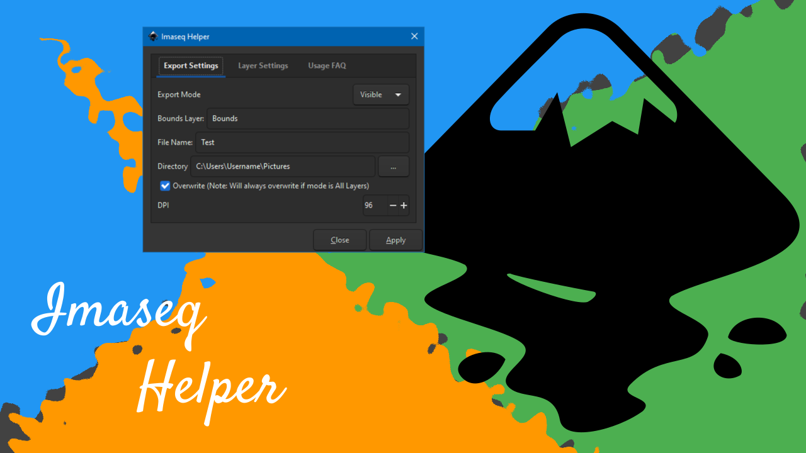
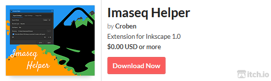

# WHAT IS IMASEQ HELPER?

Imaseq Helper is a free and open-source extension for Inkscape 1.0, released under the GPL version 3 license. This extension allows you to export PNG images by visibility or layers. You can also choose to make the extension duplicate a layer base on a setting, which is a common task when making a frame by frame animation.

# FEATURES

   - Export PNG image(s) to a fixed directory.
   - Export images using the layer name as a file name.
   - Batch export of rectangles or layers with incremented naming option.
   - Duplicate layers with incremented name and opacity of your choice.

# VIDEO

# HOW IT WORKS?

To make the extension work, you will have to create a layer that has a “rectangle object” in it. And it has to be a rectangle object, not a circle or rectangle path. This rectangle object will serve as a selection export area. Everything visible within the bounds of the rectangle will be exported as a PNG image.

# INSTALLATION

1. You must have Inkscape 1.0 installed.
2. Close Inkscape if it is open.
3. Copy or move the imaseq_helper.inx and imaseq_helper.py into Inkscape extension folder.
    - On Mac and Linux it is in ~/.config/inkscape/extensions.
    - On Windows it is in C:\Program Files\Inkscape\share\inkscape\extensions.
4. Launch Inkscape.

If you install it correctly, you should see “Imaseq Helper” on “Export” sub-menu under the “Extensions” menu.

# HOW TO USE?

1. Select an “Export Mode”
    - None – The extension will not export anything.
    - Visible – Everything visible within the rectangle object gets exported as a single PNG image.
    - All Layers – Every layer except for the bounds and sub-layers will get exported individually.

2. Set a “Bounds Layer”
    - Create a new layer, name it, then type the name on the input field.
    - Add a “rectangle object” and make sure it’s big enough and position it to capture the target view.

3. Give it a “File Name”
    - You can choose to input a file name or leave it blank to use the layer name.

4. Choose a “Directory”
    - Set a folder where exported images will be saved.

5. To “Overwrite” or not
    - If not checked existing file will not be overwritten unless the “Export Mode” is “All Layers”

6. Set image “DPI”
    - To determine the desired DPI select the “rectangle object,” open export window (Shift+Ctrl+E), go to the "Selection" tab, in the "Image size" section, you can see the DPI.
    - If you want to export using the dimensions of the rectangle object, you can set the DPI to a number lower than one like zero.

7. To “Duplicate Layer” or not
    - On the “Layer Settings” tab, you can set to duplicate the selected layer if the “Export Mode” is “Visible” or “None”

8. Set “Layer Opacity”
    - This slider will determine the opacity of the duplicated layer.

# FRIENDLY TIPS

1. Using “Multiple” Rectangle Objects
    - Will not guarantee correct file name order, because the rectangles may get exported randomly. In this case, consider moving the target images to its own layer and use “All Layers” as the export mode.

2. Setting Export Mode To “All Layers”
    - This mode produces temporary files equal to or more than the number of layers to be exported. Therefore, you are advised to clean these temporary at your convenience.
    - Setting a file name will not guarantee correct naming order, because layers may get exported randomly. So it is best to leave the file name blank and use the layer name instead.

3. Fixed Background For All Exports
    - If you have a background on a separate layer and want it to be visible on every export. You can make the background layer a child of the bounds layer. Just make sure you set the alpha or opacity of the rectangle object to zero.

4. Child Layers Are Not Exported Individually
    - If you have a group of layers, only the parent layer is exported. But if the child layers are visible, then they too will be captured on the exported image.

5. Export Using The Dimensions Of The Rectangle Object
    - If you set the DPI to zero, the dimension of the rectangle object will be used as the dimension of the image. But keep in mind that if the dimension in “pixels” is not a “whole number,” it will be rounded to the nearest one. Example 24.1 pixels will be 24 pixels, 99.5 pixels will be 100 pixels, etc. 

